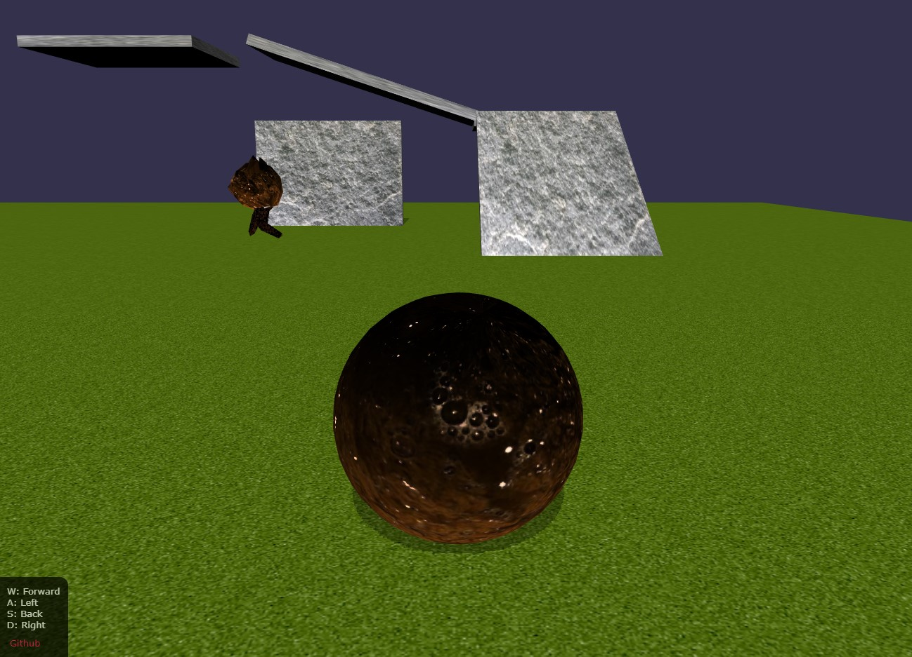

## Plot

You are Dirtball. A highly-trained ball of sludge and spit on his first mission.

Play the game here: [johnschottler.com/dirtball](http://johnschottler.com/dirtball/index.html)

## Tech stuff

- [babylonjs](https://www.babylonjs.com/)
    - game engine
        - rendering meshes and textures
        - lighting, shadows
        - keyboard control helpers
- [cannonjs](https://github.com/schteppe/cannon.js)
    - physics
        - collision detection and reactions
        - gravity

## Running locally

- `npm i`
- `npm start`
- open http://localhost:8080/

## TODO:

- confirm works and renders/loads quickly on non-beast computer
- extract components from index.js, so more organized and manageable as it gets more complex
- code-split, using dynamic imports
    - see junk.txt...
    - refactor code first
        - separate out `character` and other distinct game components accordingly
        - dynamic import major game components
        - later on, lazy-load levels as user progresses through game
- smarter camera
    - when character changes direction, rotate accordingly
- get `.glb` files to download when not running locally
    - glb won't load from nano-server IIS. registered mime, still nothin
- repeat stone material and possibly down-size texture images
- generate random mazes for dirtball to roam through
    - make concept of levels
    - pause menu
    - life bar
      - hurt when hit surface hard. take more life depending on how quickly dirtball slowed down
      - maybe spawn characters who can attack dirtball
    - other common game features...
- make him leave trails of sludge whereever he goes lol
